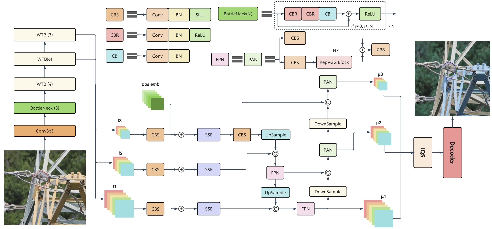

# WS-DETR: Wavelet-Guided Real-Time Detection Transformer with Sparse Spatial Attention

**WS-DETR** is a state-of-the-art real-time object detection framework tailored for industrial applications, integrating wavelet-guided feature extraction and sparse cubic attention to address challenges in occluded, multi-scale, and cluttered environments.



## Key Features
- **Wavelet-Guided Backbone**: Expands receptive fields by 8× through Daubechies wavelet decomposition, achieving **77.4% AP50** on industrial defect detection.
- **Sparse Spatial Encoder (SSE)**: Reduces attention computation by 60% via 3D adaptive sampling while maintaining accuracy.
- **Real-Time Efficiency**: 114 FPS on NVIDIA T4 GPU with 44.3M parameters (21% faster than RT-DETR).
- **Robust Industrial Adaptation**: State-of-the-art performance on HQAD (63.1% AP5095), MPID (72.6% AP5095), and RD (78.2% AP5095) benchmarks.

## Installation
```bash
# Clone repository
git clone https://github.com/he13689/WS-DETR.git
cd WS-DETR

# Install dependencies
pip install -r requirements.txt

# Download pretrained models
in ./weights folder
